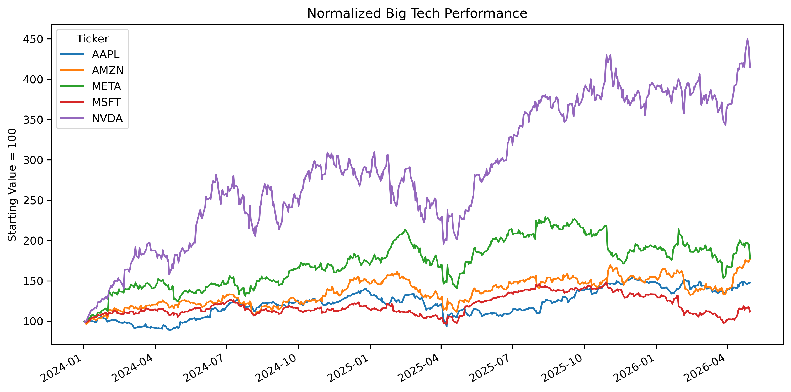
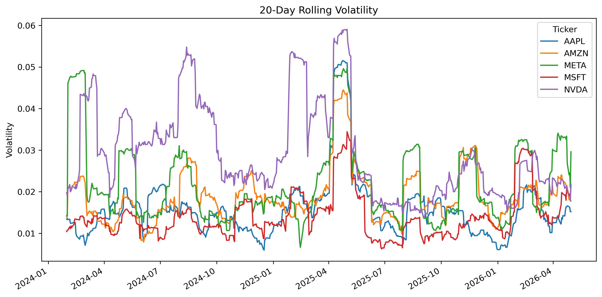
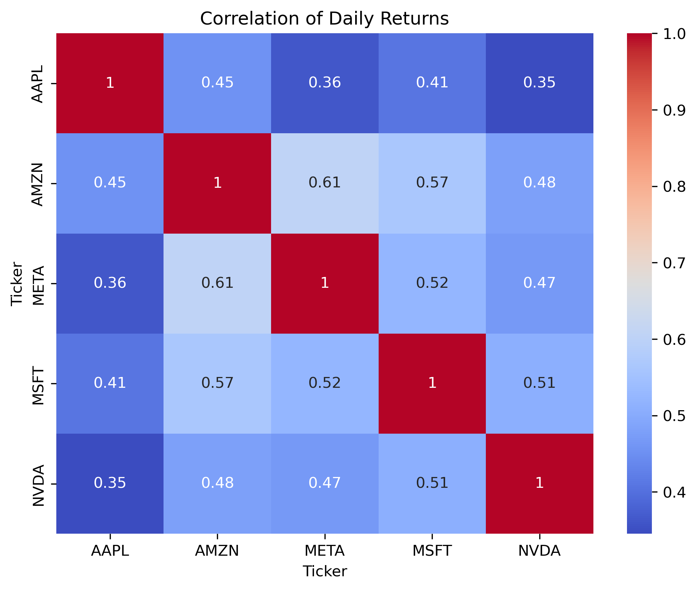

# tech-sector-momentum-analysis
# Momentum and Risk Analysis in US Large-Cap Technology Stocks

A quantitative finance mini-project analyzing momentum, volatility, and correlation patterns among major US technology equities using Python and historical market data.

---

# Project Overview

This project studies the behavior of large-cap US technology stocks between January 2024 and May 2026. The analysis focuses on identifying meaningful market patterns and converting those observations into a simple momentum-based trading strategy.

The project explores:
- price trends,
- rolling volatility,
- stock return correlations,
- and momentum persistence within the technology sector.

A simple momentum rotation strategy is also proposed along with a framework for backtesting and risk evaluation.

---

# Stocks Analyzed

| Company | Ticker |
|---|---|
| Apple | AAPL |
| Microsoft | MSFT |
| NVIDIA | NVDA |
| Amazon | AMZN |
| Meta Platforms | META |

---

# Technologies Used

- Python
- Pandas
- NumPy
- Matplotlib
- Seaborn
- yfinance

---

# Dataset

Historical market data was collected using the Yahoo Finance API through Python’s `yfinance` library.

### Variables Used
- Adjusted Closing Prices
- Daily Returns
- Trading Volume
- 20-Day Rolling Volatility

### Time Period
January 2024 – May 2026

---

# Key Findings

## 1. NVIDIA Displayed Strong Momentum Outperformance

NVIDIA significantly outperformed peer technology equities during the sample period, reflecting strong AI-driven market sentiment and momentum persistence.

### Normalized Performance Chart



---

## 2. Higher Returns Were Associated With Higher Volatility

NVIDIA also exhibited the highest rolling volatility among the selected equities, highlighting the risk-return tradeoff commonly observed in high-growth technology stocks.

### Rolling Volatility Chart



---

## 3. Technology Stocks Showed Moderate-to-High Correlation

Daily returns across the selected equities displayed positive correlations, suggesting limited diversification benefits within the same sector during periods of market stress.

### Correlation Heatmap


---

# Proposed Trading Strategy

## Momentum Rotation Strategy

### Strategy Rules

Every 20 trading days:

1. Calculate trailing 30-day returns for all stocks.
2. Rank stocks based on performance.
3. Select the best-performing stock.
4. Hold the position for the next 20 trading days.
5. Rebalance and repeat.

### Rationale

The strategy is based on the observation that strong-performing technology stocks tended to continue outperforming over short-to-medium-term periods.

Possible drivers include:
- institutional capital flows,
- investor herding behavior,
- and delayed reactions to growth expectations.

---

# Backtesting Framework

The proposed strategy can be evaluated through historical simulation using:

- cumulative returns,
- Sharpe ratio,
- volatility,
- maximum drawdown,
- and win rate.

The strategy should also be compared against an equal-weight benchmark portfolio containing all five equities.

---

# Risks and Limitations

Key limitations of the analysis include:

- Overfitting risk
- Limited sample size
- Momentum reversal risk
- Concentration risk
- Transaction costs and slippage

---

# Repository Structure

```text
tech-sector-momentum-analysis/
│
├── data/
│   └── stock_data.csv
│
├── charts/
│   ├── normalized_performance.png
│   ├── rolling_volatility.png
│   └── correlation_heatmap.png
│
├── notebook/
│   └── analysis.ipynb
│
├── report/
│   └── Momentum_and_Risk_Analysis.pdf
│
├── strategy.py
│
├── requirements.txt
│
└── README.md
